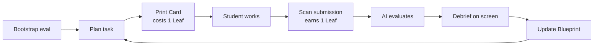

# Atrium

A self-serve AI learning hub for Bright Horizon Chinese School. Students rotate through a shared kiosk — scanner, monitor, printer — and get a personalized loop: assess → assign → print → work → submit → reflect → re-plan.

For full context on what we're building and why, read `CLAUDE.md` first.

## The flywheel



## User stories

| | | |
|:---:|:---:|:---:|
|  |  |  |
| First visit — AI builds the initial skill map | AI picks the next task from the student's frontier | Student spends a Leaf to print their worksheet |
|  |  |  |
| Student completes the worksheet at their desk | Completed paper placed under the document camera | AI grades the scan against the rubric |
|  |  |  |
| Parent reviews per-question feedback on their phone | Parent sees the updated skill radar on their phone | Student earns a Leaf — the loop restarts |

## Repo layout

```
packages/
  kiosk/          React SPA — check-in, chat (Docent), scan-submit (:5173)
  skill-graph/    KC graph + BKT student state service (:3001)
  worksheet/      Card PDF generator with QR header (:3002)
  evaluator/      Submission evaluator — Gemini multimodal grading (:3003)

product/          Decision layer: user stories, PRD, tech spec
  00-index.md     ← start here for product context
impl/             Per-service build plans and phase checklists
  roadmap.md      ← start here for phase status
docs/             Reference: research, pedagogy, brand
  00-index.md     ← start here for background reading

infra/
  supabase/migrations/   Database schema migrations
CLAUDE.md         Project source of truth — read before coding
```

## Domain vocabulary

Internal terms used throughout the codebase and docs. Full rationale in `docs/brand/naming-rationale.md`.

| Term | Meaning |
|------|---------|
| The Blueprint | The dynamic skill tree (DAG of KCs) |
| Room | A Knowledge Component — one atomic skill node |
| Floor plan | A student's current mastery state across all Rooms |
| The Docent | The AI assistant persona — present, contextual, transparent |
| Visit | A kiosk session |
| Card | A printed worksheet |
| The Debrief | The per-session feedback report (digital-first) |
| The Landing | A student's frontier KCs — not too easy, not too hard |
| Leaf | A print credit — earned by submitting a Card, spent to print the next one |
| Exhibit | A scanned creative contribution (drawing, story, etc.) |
| The Gallery | Parent-facing view of a student's Exhibits |

## Quick start

```bash
pnpm install
pnpm -F kiosk dev           # :5173
pnpm -F skill-graph dev     # :3001
pnpm -F worksheet dev       # :3002
```

Python evaluator:
```bash
cd packages/evaluator
python -m venv .venv && source .venv/bin/activate
pip install -r requirements.txt
uvicorn src.main:app --reload --port 3003
```

Copy `.env.example` → `.env` and fill in your Gemini API key and Supabase credentials before starting.

## Tech stack

- **LLM:** Gemini API (active) — Flash for cost paths, Pro for evaluation quality
- **Student model:** pyBKT (Bayesian Knowledge Tracing); upgrade to DKT/pyKT after ≥10K logs
- **Voice:** Deferred — not a v1 requirement
- **Frontend:** React + Vite + TypeScript, inline styles, DM Sans font
- **Backend:** Node/TypeScript (skill-graph, worksheet), Python FastAPI (evaluator)
- **Database:** Supabase Postgres
- **PDF rendering:** HTML → Playwright headless Chromium → PDF

## Integration with BHCS portal

Student identity, parent visibility, and wallet/credits live in `rabbitzzy/bhcs`. Atrium reads student profiles from the portal API and pushes session reports back. It never holds passwords or PII independently.

---

## Agent bootstrap (new machine setup)

Memory and skills live outside the repo. On a fresh machine, restore them with:

### 1. Install Claude Code skills

```bash
npx skills add google-gemini/gemini-skills   --skill gemini-api-dev              -g -y
npx skills add supabase/agent-skills         --skill supabase                    -g -y
npx skills add supabase/agent-skills         --skill supabase-postgres-best-practices -g -y
npx skills add vercel-labs/agent-skills      --skill vercel-react-best-practices  -g -y
npx skills add anthropics/skills             --skill pdf                          -g -y
npx skills add anthropics/skills             --skill webapp-testing               -g -y
npx skills add currents-dev/playwright-best-practices-skill --skill playwright-best-practices -g -y
npx skills add 199-biotechnologies/claude-deep-research-skill --skill deep-research -g -y
npx skills add anthropics/skills             --skill doc-coauthoring              -g -y
```

Verify: `npx skills list -g`

### 2. Restore project memory

Memory files live in `~/.claude/projects/<encoded-path>/memory/` and are machine-local. Either:

**Option A — copy from primary machine:**
```bash
# On primary machine, zip and transfer
zip -r atrium-memory.zip ~/.claude/projects/-Users-zhenyanzhu-src-atrium/memory/
# On new machine, adjust path to match your local repo location:
# ~/.claude/projects/-Users-<you>-src-atrium/memory/
```

**Option B — regenerate from docs:**
Start a Claude Code session in this repo and run `/init`. The memory rebuilds from `CLAUDE.md`, `product/`, `docs/`, and `impl/`. Key things to re-establish:
- LLM choice is Gemini API (not Claude) — correct if /init assumes otherwise
- Skills mapping (run the installs above first; memory should reference them)
- Research cascade rule: research changes must cascade through `product/` before `impl/`
