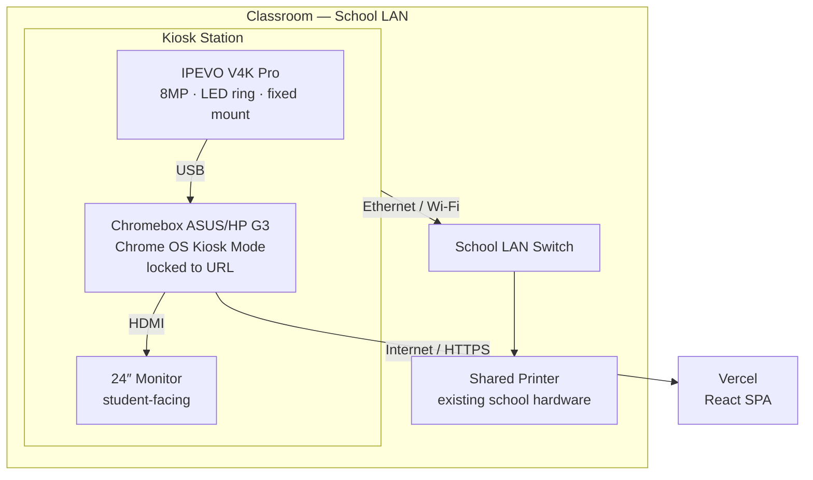
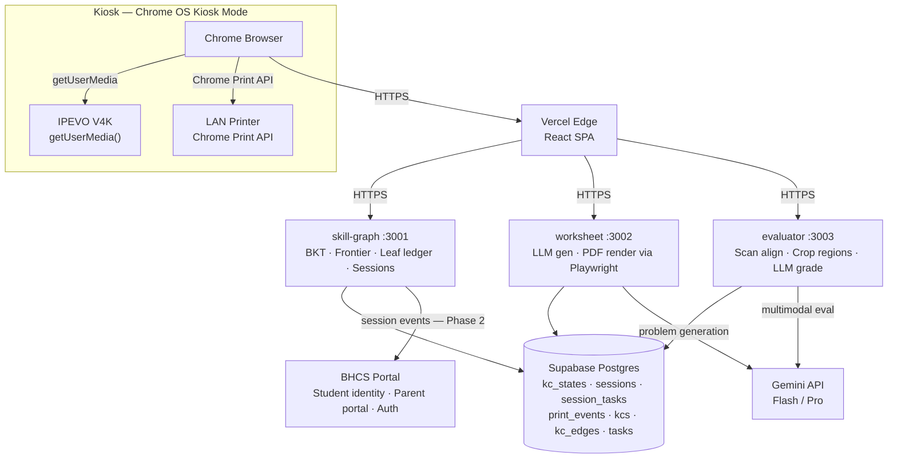
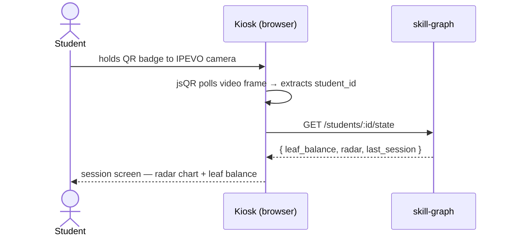
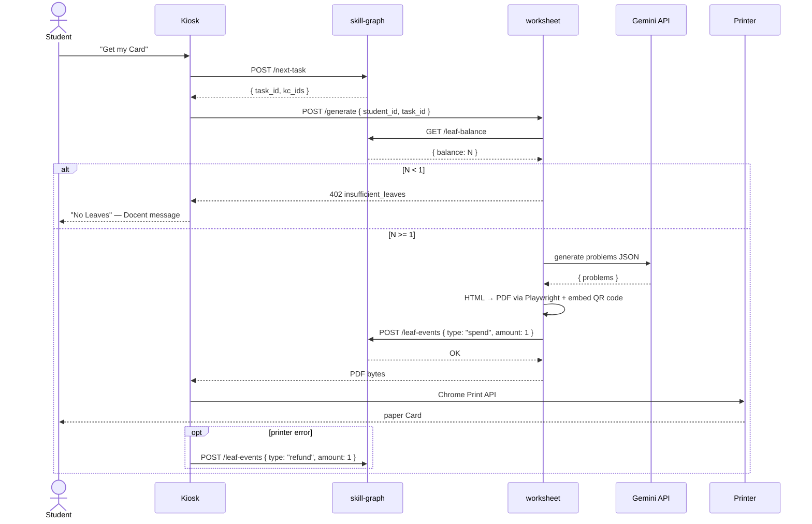
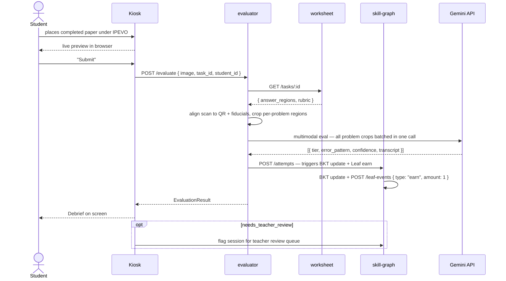
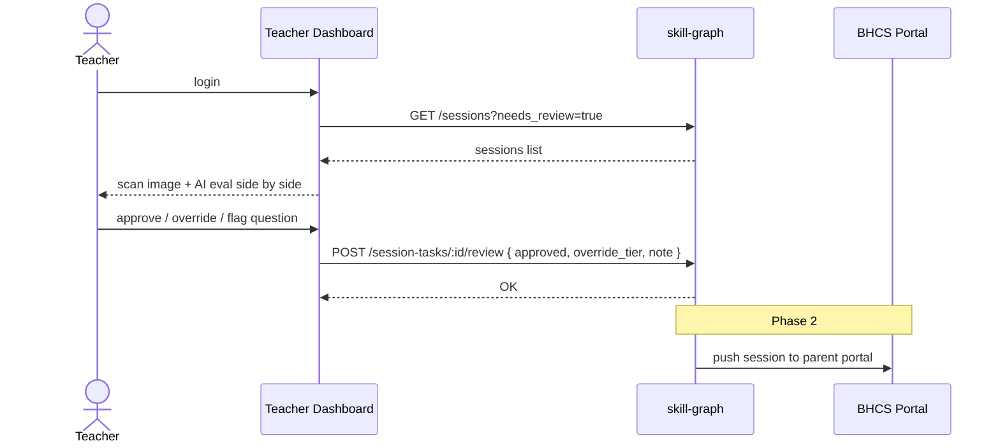
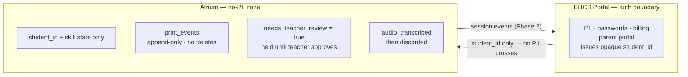

# Architecture Overview

> **Last updated:** 2026-05-03
> **Status:** Active — aligns to Phase 0 hardware decisions and tech-spec v1.
>
> Single source of truth for the full system topology: hardware through cloud. When any layer changes, update this first, then cascade to `/product/tech-spec.md` and `/impl/`.
>
> **Critical design constraints driving every decision here:**
> - No student-owned devices — kiosk is the only access point
> - Paper is a gated resource (Leaf economy) — print and scan paths are transaction boundaries
> - All AI evaluation is provisional — teacher review is a first-class concept, not an afterthought
> - PII lives only in the BHCS portal — Atrium stores only opaque `student_id`

---

## 1. Hardware Topology

**Hardware decisions (see `/docs/research/kiosk-hardware.md` for full rationale):**

| Component | Choice | Why |
|---|---|---|
| Compute | Chromebox (ASUS/HP G3) | Chrome OS Kiosk Mode — boots to a single URL, no escape |
| Display | 24" 1080p monitor | Shared station; students stand at desk |
| Scan camera | IPEVO V4K Pro (USB) | US K-12 standard; browser sees as webcam via `getUserMedia()` |
| Check-in | IPEVO camera + jsQR in browser | No separate barcode gun; a few seconds is acceptable |
| Printer | Existing school LAN printer | Already present; Chrome Print API handles it |
| Audio/voice | Deferred — not a v1 requirement | |

---

## 2. Software Topology

---

## 3. User Flow: Check-in

**Critical path:** QR decode must work reliably in classroom ambient light. The IPEVO LED ring light is always on during check-in. If QR fails: fallback to PIN (not yet designed — open question in user-stories.md).

---

## 4. User Flow: Print Card (Leaf gate is a transaction boundary)

**Transaction rule:** Leaf spend and print are not atomic at the hardware level. The refund event on printer failure is the compensating transaction — `print_events` is append-only, no modifications ever.

---

## 5. User Flow: Submit Card + Evaluate (core flywheel step)

**Target latency:** ≤30s from camera capture to Debrief displayed (p95). Batch all problem crops into a single Gemini call — one call per submission, not one per problem.

---

## 6. User Flow: Teacher Review

**Trust arc (from user-stories.md):** Phase 1 = every evaluation reviewed before parent sees it. Phase 2 = only `needs_teacher_review: true` flagged cases. Phase 3 = async monitoring. The dashboard is **not polish** — it is load-bearing for teacher adoption.

---

## 7. Security and Trust Boundaries

---

## 8. Critical Design Tensions (stay honest about these)

| Tension | Current answer | When to revisit |
|---|---|---|
| **Latency vs cost** | Single Gemini API call with all problem crops batched | If p95 > 30s, consider Flash for transcript + Pro only for borderline tiers |
| **Scan reliability** | Fixed-template alignment (QR + 3 fiducial marks) | If QR is occluded by student writing: fall back to fiducials only |
| **Leaf transaction atomicity** | Compensating refund event on printer failure | If printer never reports failure reliably: add a "print confirmation" UI step |
| **Teacher review throughput** | Phase 1 = 100% review | If teacher load is too high at pilot: accelerate to Phase 2 (flagged-only) earlier |
| **Check-in fallback** | QR badge via IPEVO camera | Badge lost/damaged: PIN fallback not yet designed — open question |
| **Chromebox ↔ printer** | Chrome Print API to LAN printer | Some school networks block device-to-device traffic — verify early |
| **Single IPEVO serves dual roles** | Check-in QR scan + worksheet submission capture | Camera cannot do both simultaneously — kiosk UI must enforce sequential mode (check-in → session → scan), never concurrent |

---

## 9. What is explicitly NOT in this architecture

- Student passwords or PII — lives only in BHCS portal
- Homework help / open chatbot — Atrium chat is task-scoped only (anti-story)
- Parent grade overrides — teachers only
- Printing without a prior submission — enforced by Leaf gate in worksheet service
- Voice I/O — deferred from v1
- Dedicated QR badge hardware scanner — replaced by IPEVO camera + jsQR

---

## References

- `/docs/research/kiosk-hardware.md` — hardware decision log and rationale
- `/product/tech-spec.md` — service contracts, DB schema, performance targets
- `/product/user-stories.md` — personas and acceptance criteria
- `/docs/pedagogy/eco-design.md` — Leaf economy full spec
- `/docs/pedagogy/teacher-direction.md` — teacher trust arc and review queue design
- `/docs/research/paper-interaction.md` — scan pipeline precedents (Gradescope, Xiaoyuan)
