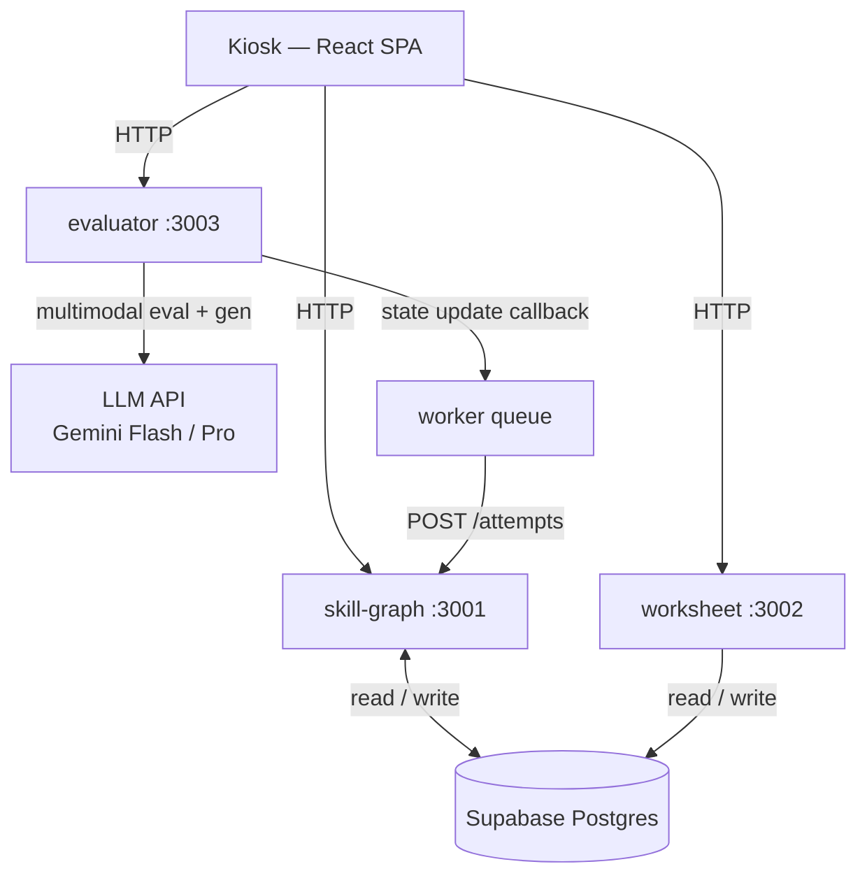

# Technical Specification

> **Last updated:** 2026-05-03
> **Status:** Active — Phase 0 in progress
>
> **Audience:** co-engineer, technical collaborators.
> **When research changes:** check "Stack decisions and rationale" — research updates often invalidate a technology choice. Cascade to `/impl/` plans after updating here.
> **Deeper context:** `product/prd.md` (what we're building), `/docs/research/open-source-stack/` (library choices), `CLAUDE.md` (architecture sketch).

---

## System overview

Four services connected by HTTP and a lightweight worker queue. The kiosk is a thin client — all intelligence lives in the backend services.



### Monorepo layout

```
packages/
  kiosk/          React SPA (Vite, port 5173)
  skill-graph/    Express API (port 3001)
  worksheet/      Express API (port 3002)
  evaluator/      Express API (port 3003)
infra/
  supabase/migrations/
```

---

## Service contracts

### skill-graph (:3001)

Core intelligence: skill tree, student state, session records.

| Endpoint | Description |
|----------|-------------|
| `GET /students/:id/radar` | Mastery probabilities across all KCs |
| `GET /students/:id/state` | Full student state (balance, last session, KC states) |
| `POST /students/:id/next-task` | Frontier selection → returns `{ task_id, kc_ids, difficulty }` |
| `POST /students/:id/attempts` | Record attempt result; triggers BKT update |
| `GET /students/:id/leaf-balance` | Current Leaf count |
| `POST /students/:id/leaf-events` | Log earn / spend / grant / refund |
| `GET /kcs` | Full KC graph |
| `POST /kcs` | Author new KC (teacher, Phase 2) |
| `GET /sessions/:id` | Session detail for teacher dashboard |

**Student state model (Postgres, Supabase)**

```sql
-- kc_states: one row per student × KC
student_id, kc_id, mastery_prob, attempt_count, last_attempt_at

-- student_print_state: Leaf balance
student_id, leaf_balance, updated_at

-- print_events: full audit log
id, student_id, event_type, amount, reason, session_id, created_at

-- sessions: one row per kiosk visit
id, student_id, started_at, ended_at

-- session_tasks: tasks attempted in a session
id, session_id, task_id, evaluation_id, teacher_reviewed, teacher_override
```

**BKT implementation**

- Library: pyBKT (`pip install pyBKT`)
- v1: use literature default parameters (prior=0.2, learn=0.2, slip=0.1, guess=0.2)
- After ~50 attempts per KC: fit per-KC parameters
- After ~500 attempts per KC: fit full joint model
- Time decay: multiply mastery probability by 0.9 per semester of inactivity (manual heuristic, not in pyBKT)
- Multi-KC items: split credit manually across tagged KCs

**Frontier selection**

Select KCs where:
1. `mastery_prob` is in [0.3, 0.8] (not trivially mastered, not unreachably hard)
2. All prerequisite KCs have `mastery_prob > 0.6`
3. Weight higher: KCs with recent failed attempts

---

### worksheet (:3002)

Generates print-ready PDF Cards.

| Endpoint | Description |
|----------|-------------|
| `POST /generate` | Generate Card PDF → returns PDF bytes or `402` if Leaf blocked |
| `GET /tasks/:id` | Task metadata (KCs, rubric, answer region coordinates) |

**Print gate logic**

```
POST /generate
  1. GET leaf_balance from skill-graph
  2. if balance < 1: return 402 { error: "insufficient_leaves", balance: 0 }
  3. call LLM to generate problems (constrained to target KCs, difficulty, interest profile)
  4. render HTML → PDF via Playwright headless Chromium
  5. embed QR code in header: encode(student_id + task_id)
  6. POST /leaf-events { type: "spend", amount: 1 } to skill-graph
  7. on printer error: POST /leaf-events { type: "refund", amount: 1 }
  8. return PDF bytes
```

**Card layout requirements**

- A4/Letter, single-sided (back blank for scratch work — never print on it)
- 3–5 problems per page; fixed answer regions sized for a 7-year-old's handwriting
- QR code top-right of header (Gradescope fixed-template pattern)
- Answer region coordinates stored in `tasks` table — used by evaluator for scan alignment
- Never print a mostly-blank Card; pad to fill with adjacent-KC supplementary problems
- Renderer: Playwright (not Puppeteer); HTML template with inline styles per BHCS portal convention

**LLM problem generation prompt constraints**

- Target KC(s) and difficulty level
- Student's interest profile themes (soft hint — do not force if quality degrades)
- Language: bilingual (Chinese + English per KC setting)
- Output: structured JSON `{ problems: [{ text, answer_regions, rubric_hints }] }`

---

### evaluator (:3003)

Receives scan images, grades against rubric, returns structured Debrief.

| Endpoint | Description |
|----------|-------------|
| `POST /evaluate` | Grade a submitted Card scan |
| `POST /extract-exhibit` | Extract themes from creative work (Phase 2.5) |

**Evaluation pipeline**

```
POST /evaluate { image, task_id, student_id }
  1. Fetch task metadata (answer regions, rubric) from worksheet service
  2. Align scan to fixed template coordinates
  3. Crop per-problem answer regions
  4. Call multimodal LLM with: cropped images + rubric per problem
     → Structured output: [{ problem_id, tier, error_pattern, confidence }]
  5. Aggregate into EvaluationResult
  6. POST /attempts to skill-graph (triggers BKT update + Leaf award)
  7. Return EvaluationResult to kiosk
```

**EvaluationResult schema**

```typescript
type QualityTier = 'mastered' | 'shaky' | 'needs-help' | 'not-yet'

interface ProblemEval {
  problem_id: string
  tier: QualityTier
  error_pattern?: string        // e.g. "ignored denominator when finding common denominator"
  confidence: number            // 0–1; low confidence → flag for teacher review
  transcript: string            // OCR'd student answer text
}

interface EvaluationResult {
  task_id: string
  student_id: string
  problems: ProblemEval[]
  overall_tier: QualityTier
  debrief_text: string          // bilingual; student-facing
  next_task_hint: string        // what to work on next
  needs_teacher_review: boolean // true if any confidence < 0.6
}
```

**LLM choices**

- Primary: Gemini API (active key in use) — Flash for cost-sensitive paths, Pro for evaluation quality
- Future: Claude Sonnet 4.6 / Opus 4.7 once Anthropic key is provisioned
- Target: scan → EvaluationResult ≤ 30s p95
- Handwriting transcription accuracy: ~97–99% per published benchmarks on clean work (see `/docs/research/paper-interaction.md`); sufficient for formative feedback, not high-stakes

**Exhibit extraction (Phase 2.5)**

```
POST /extract-exhibit { image, student_id }
  → Claude Haiku: extract { caption, themes[], interest_signals[] }
  → POST /students/:id/exhibits to skill-graph
  → Triggers interest profile merge
```

---

### kiosk (React SPA, :5173)

Thin client. Three modes that match the flywheel steps.

| Mode | Trigger | Functionality |
|------|---------|---------------|
| Check-in | Landing screen | QR badge scan → load student state |
| Chat | During session | Keyboard; Docent persona; Leaf balance visible (voice STT + TTS: Phase 3) |
| Scan | Submit Card button | Camera capture → POST to evaluator → display Debrief |

**UI conventions**

- DM Sans font (BHCS portal convention)
- Inline styles (BHCS portal convention)
- Leaf balance indicator: top-right, eco green `#4a7c59`, always visible during a session
- Zero-balance state: amber `#c8963e` indicator; Docent message in Chat mode
- No heavy state — kiosk is a thin client; state lives in skill-graph

**Voice privacy (Phase 3 — when voice is enabled)**

- Mic muted on idle (Merlyn Mind pattern — children's voices in shared spaces)
- No persistent audio recording; STT transcript only; raw audio discarded immediately

---

## Stack decisions and rationale

| Concern | Choice | Rationale | Revisit when |
|---------|--------|-----------|-------------|
| Student model | pyBKT | Proven 25-year baseline; 4 interpretable parameters; no data needed to start | ≥10K logs → evaluate pyKT / DKT |
| LLM for eval + gen | Gemini API (Flash/Pro) | Active API key in use; strong vision + bilingual; cost-effective | Anthropic key provisioned → evaluate Claude Sonnet 4.6 |
| Math handwriting OCR | Multimodal LLM (no separate OCR) | 97–99% accuracy on clean work; eliminates Pix2Text/Mathpix dep in v1 | Accuracy issues or cost → Pix2Text |
| PDF rendering | Playwright + headless Chromium | Deterministic layout; HTML/CSS authoring; BHCS portal team familiar | Never — Playwright is the right call |
| Scan alignment | Fixed-template overlay (Gradescope pattern) | Robust to camera angle; answer regions at fixed coordinates | Never — don't invent an alternative |
| DB | Supabase (Postgres) | Already used by BHCS portal; no new infra | Never for v1 |
| Worker queue | Postgres-backed queue (simple) | Already have Postgres; avoids Inngest/Trigger.dev dependency in v1 | Job volume > 1K/day → Inngest |
| Voice STT | Whisper (Phase 3) | Open source; bilingual; good accuracy — deferred from v1 | Phase 3 start → add ElevenLabs or OpenAI TTS |
| Frontend | React + Vite | BHCS portal convention | Never |
| KC taxonomy | Common Core (math), Core Knowledge (general), Hanzi frequency (Chinese) | Standard starting points; no licensing issues | When teachers author their own KC extensions |

---

## Security and privacy boundaries

- **No PII in Atrium.** Student names, contact info, and auth credentials live only in the BHCS portal. Atrium stores only `student_id` (a portal-issued opaque ID).
- **No persistent audio (Phase 3).** When voice is enabled: microphone input transcribed on the fly; raw audio discarded immediately.
- **Teacher review before parent visibility.** Session evaluations with `needs_teacher_review: true` are not pushed to the parent portal until a teacher approves or the review window expires (async).
- **Leaf events are append-only.** No deletion from `print_events`. Refunds are logged as a separate event type, not by modifying the original spend record.

---

## Performance targets

| Operation | Target |
|-----------|--------|
| Scan → EvaluationResult (p95) | ≤ 30 seconds |
| `nextTask` response | ≤ 2 seconds |
| PDF generation | ≤ 10 seconds |
| Kiosk page load (cold) | ≤ 3 seconds |

---

## References

- `/docs/research/open-source-stack/student-modeling.md` — pyBKT API, pyKT upgrade path
- `/docs/research/open-source-stack/ocr.md` — OCR library comparison
- `/docs/research/design-patterns.md` — Gradescope template pattern, QR-coded paper
- `/docs/research/competitive-landscape.md` — Squirrel AI architecture reference
- `/docs/pedagogy/eco-design.md` — Leaf economy full spec
- `/docs/pedagogy/teacher-direction.md` — Teacher trust arc; review queue design
- `/impl/` — Service-level build plans and phase checklists
