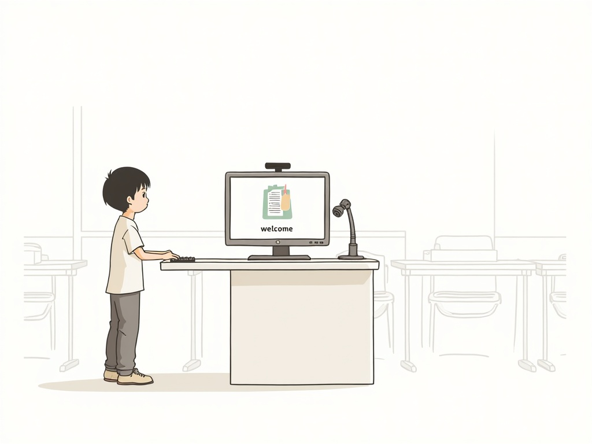
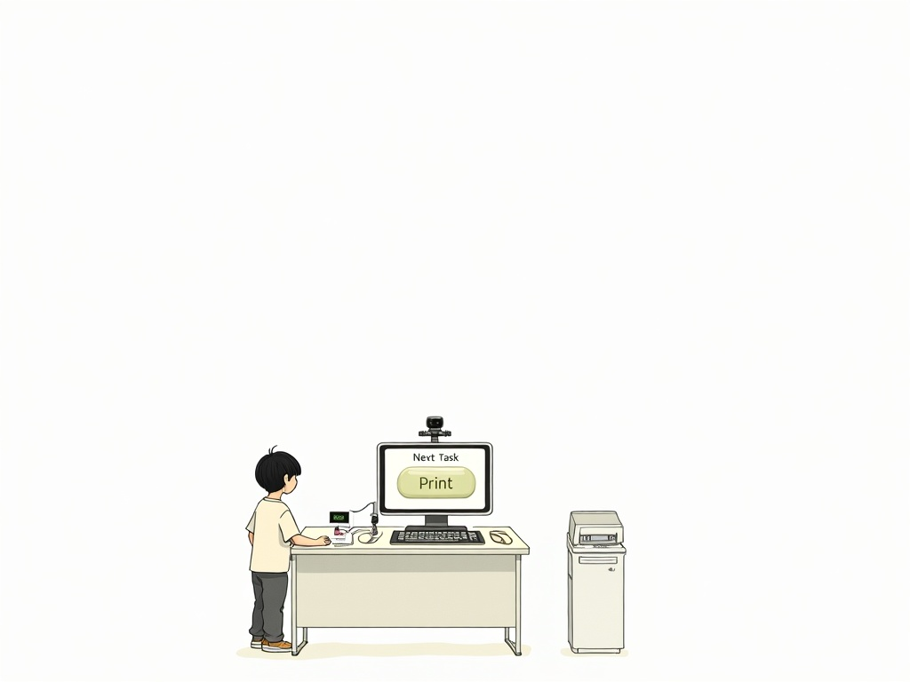
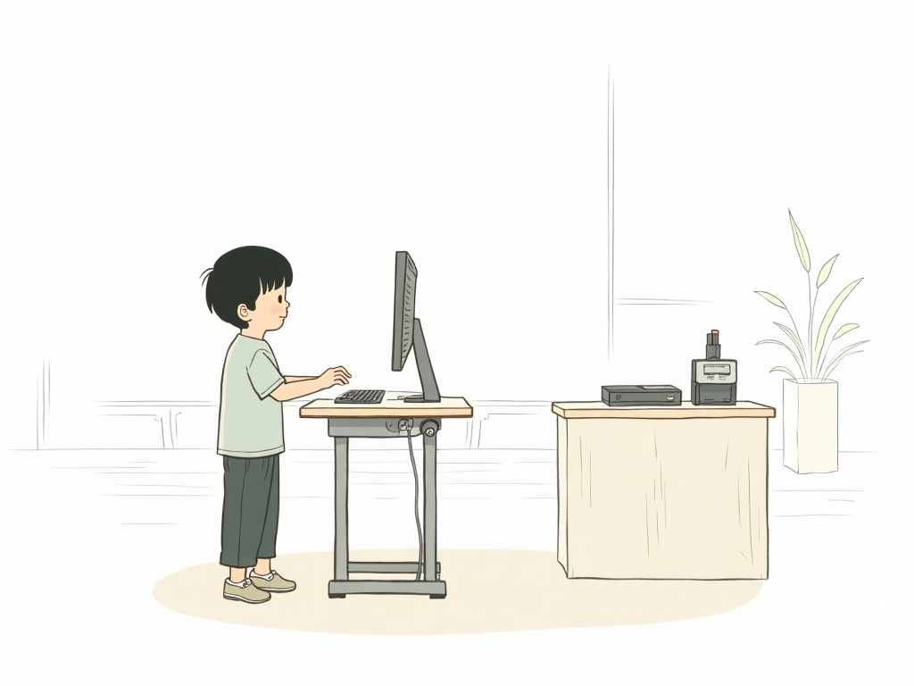
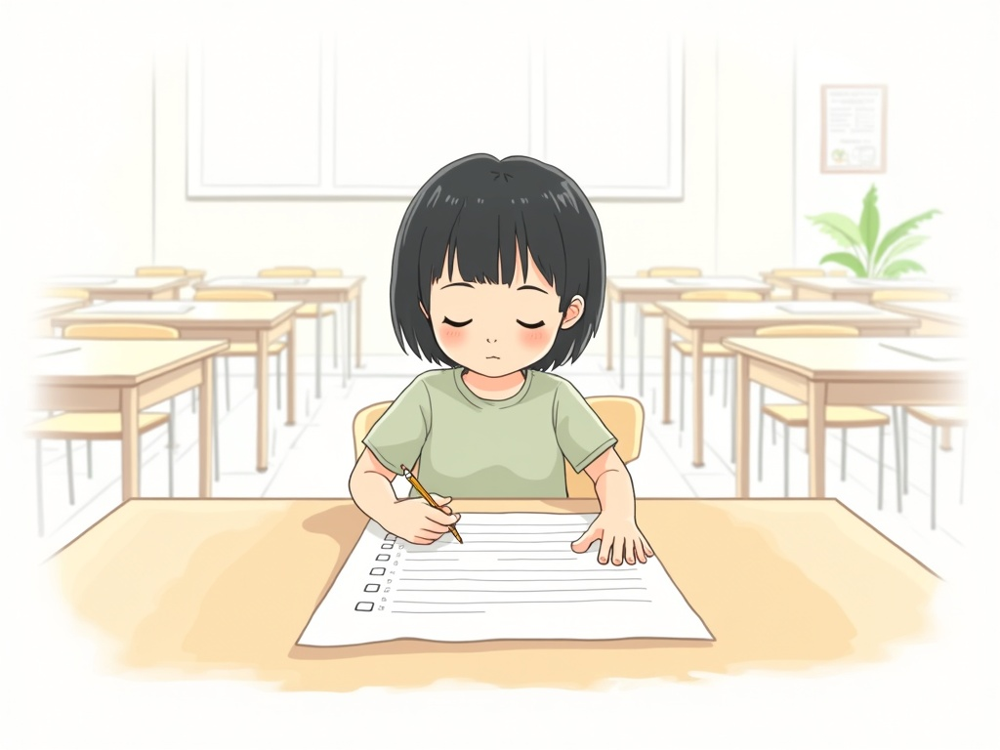
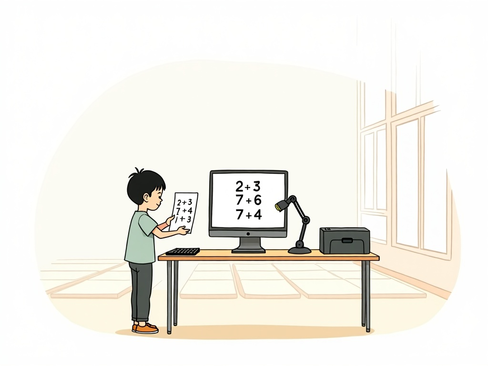
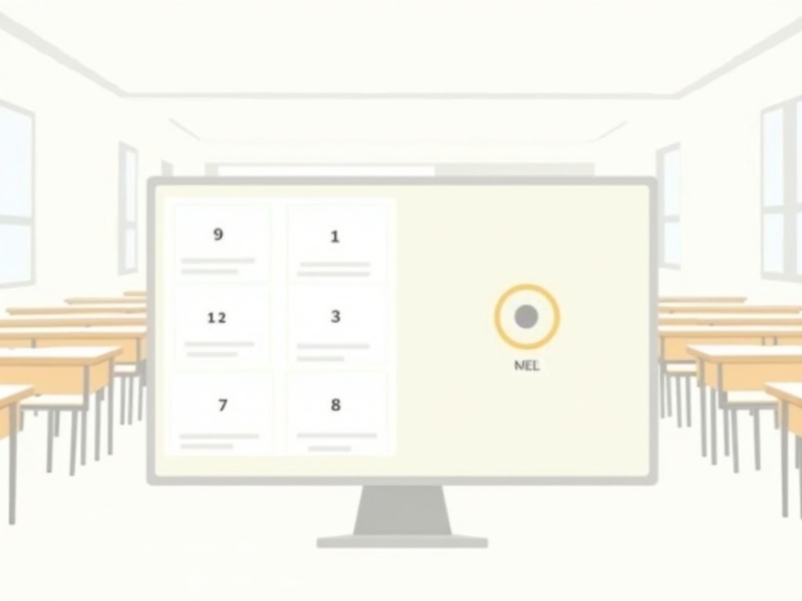
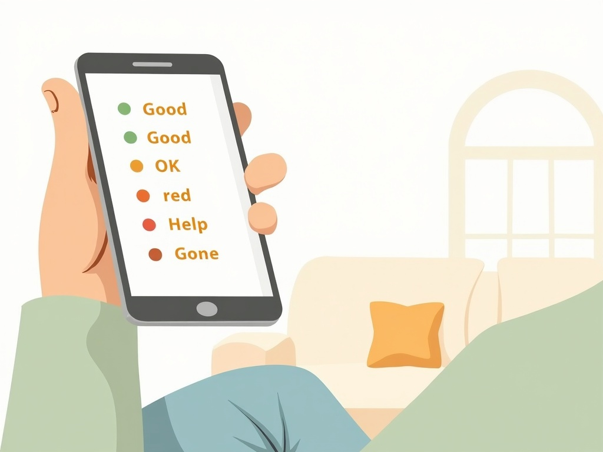
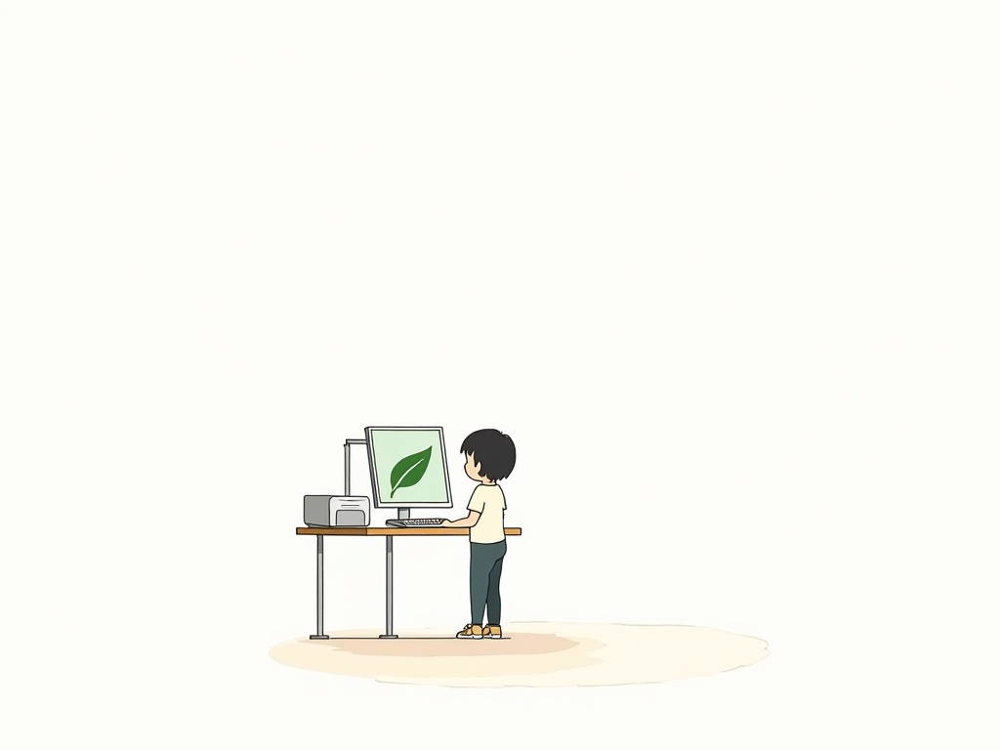

# User Stories

> The decision layer between research and requirements. When `/docs/research/` changes, check here first: do new findings change who does what, or under what constraints?
>
> **Audience:** designer, product, anyone orienting to the system for the first time.
> **Deeper context:** `CLAUDE.md` (domain model + operational reality), `/docs/pedagogy/` (pedagogy constraints), `/docs/research/` (competitive landscape, design patterns).

---

## The flywheel illustrated

Each row is one step in the student session loop. Hardware shown throughout: shared kiosk (flat-panel monitor · keyboard · IPEVO V4K Pro document camera · printer). Illustrations are Miyazaki-influenced sketch style — see `tools/illustrate.ts` to regenerate.

| Step | Illustration | Who | What happens | Key constraint |
|:---:|---|:---:|---|---|
| **1 · Bootstrap eval** |  | Mei (student) | First-ever visit. Student checks in at the kiosk. System runs a short diagnostic to build the initial skill map (radar chart) across Math, Reading, Writing, Art, Science, Chinese. | Must complete in one short session. Radar chart is shown on screen — not printed. |
| **2 · Plan task** |  | System | AI selects the next KC from the student's frontier — skills in the 0.3–0.8 mastery band. The Docent surfaces the selection as a simple screen: "Next Task" + Print button. Student reads and confirms; no typing required. | Selection is transparent. Student and teacher can always see which KC was chosen and why. |
| **3 · Print Card** |  | Mei | Student presses Print. System deducts 1 Leaf from balance. Printer outputs a letter-size worksheet: five arithmetic problems, blank answer boxes, QR code in header. Student collects the paper. | Blocked if Leaf balance = 0. Paper is not printed speculatively — it costs a Leaf. |
| **4 · Student works** |  | Mei | Student takes the worksheet to any school desk and works through the problems with a pencil. May return to the kiosk keyboard to ask the Docent a clarifying question mid-task. | No device required. The paper is the artifact. Voice input is Phase 3. |
| **5 · Scan submission** |  | Mei | Student returns to the kiosk and places the completed worksheet flat on the counter, centered under the IPEVO V4K Pro document camera. Camera captures a top-down image. Monitor confirms the capture. | Paper must be flat and within the camera frame. No holding up. Target capture time: under 3 seconds. |
| **6 · AI evaluates** |  | System | Scanned image is sent to the submission evaluator. Gemini multimodal model reads each answer box against the rubric and returns a structured result: per-question quality tier + misconception if any. | Target: under 30 seconds end-to-end. Student waits at the kiosk. No re-scan needed for low-confidence results — flag for teacher review instead. |
| **7 · Debrief** |  | Parent | Debrief is shown on the kiosk screen (digital-first, always free). Parent also receives it in the BHCS portal. Phone view shows a simple per-question checklist: colored dot per row (green = Mastered, amber = Shaky, red = Needs help). | Debrief is not a grade. Teacher retains override authority. Printing the Debrief costs 0 Leaves but requires explicit opt-in. |
| **8 · Update Blueprint** |  | System + Parent | BKT model updates mastery probabilities for the targeted KC(s). The student's radar chart (Floor plan) shifts. Parent sees the updated chart on their phone — one segment larger, labeled with the subject. | Mastery never drops below 0 in a single session. Low-confidence evaluations widen the confidence band rather than shifting the mean. |
| **9 · Award Leaf** |  | Mei | Student earns 1 Leaf for submitting a completed Card (regardless of score). Leaf balance increments on screen. The Docent confirms the next task is ready. Student can print the next Card immediately. | Leaf is awarded for submission, not for correctness — avoids penalising struggle. Loop returns to step 2. |

---

## Personas

### Student — "Mei" (age 7, 2nd grade)
- Attends BHCS on weekends. No personal device at the kiosk.
- Reads at a mixed Chinese/English level. May struggle with long instructions.
- Motivated by tangible progress and physical artifacts (paper = real).
- Attention span: ~20–30 minutes on a focused task.

### Teacher — "Ms. Chen"
- Traditional classroom teacher, comfortable with worksheets, skeptical of AI grading.
- Not present at the kiosk during student sessions.
- Wants to stay in control; will disengage if the system makes decisions without her input.
- Trust arc: Observer → Collaborator → Multiplier (see `/docs/pedagogy/teacher-direction.md`).

### Parent — "Mei's mom"
- Enrolled Mei in BHCS for academic enrichment. Monitors progress via the BHCS parent portal.
- Wants to know what her child worked on and whether it's having an effect.
- Values eco-consciousness; will respond positively to sustainable framing if not preachy.

### Admin / BHCS Staff
- Manages enrollment, billing, and portal accounts. Not involved in daily kiosk flow.
- Needs to grant initial access to Atrium from the existing BHCS portal.

---

## Student stories

**Check-in**
> As Mei, I want to scan my badge QR code at the kiosk so that the system knows who I am and where I left off — without needing to type a password.

**Receiving a task**
> As Mei, I want the kiosk to give me a worksheet that matches what I'm ready to learn next — not too easy, not too hard — so that I feel challenged and not bored or lost.

**Printing my Card**
> As Mei, I want to print my worksheet (Card) so that I can work on it with a pencil away from the screen.

**Blocked from printing (0 Leaves)**
> As Mei, when I have no Leaves, I want the kiosk to explain clearly what I need to do to earn one — not shame me — so I know exactly what to do next.

**Asking for help mid-task**
> As Mei, I want to ask the Docent a question about my worksheet (by voice or keyboard) so that I can get a hint without being given the answer.

**Submitting my Card**
> As Mei, I want to scan my completed worksheet so that my work is recorded and I earn a Leaf for the next Card.

**Seeing my Debrief**
> As Mei, I want to see feedback on my work on the screen — what went well and what to work on — in language I can understand (Chinese or English), so I know whether I'm improving.

**Seeing my progress**
> As Mei, I want to see a picture of all the things I know (radar chart) so that I can feel proud of how much I've learned.

**Sharing a drawing (Exhibit)**
> As Mei, I want to scan a drawing I'm proud of so that it shows up in my gallery that my parents can see.

---

## Teacher stories

**Reviewing AI evaluations (Phase 1 — Observer)**
> As Ms. Chen, I want to review every AI-generated grade before it reaches a student or parent so that I stay in control and can catch AI mistakes early.

**Overriding a grade**
> As Ms. Chen, I want to override an AI grade with one click and add a note so that my correction is recorded and informs the rubric over time.

**Flagging a bad question**
> As Ms. Chen, I want to flag a generated question as confusing or wrong so that it is pulled from rotation and I get credit for improving the question pool.

**Switching to flagged-only review (Phase 2 — Collaborator)**
> As Ms. Chen (after building trust), I want to only review cases the AI is unsure about — unclear handwriting, novel error patterns, anomalous trajectories — so that I spend my review time where it matters.

**Viewing student progress**
> As Ms. Chen, I want to see each student's radar chart and session history so that I can identify who needs a 1-on-1 intervention.

**Granting a Leaf**
> As Ms. Chen, I want to grant a bonus Leaf to a student — with a logged reason — so that a student isn't stuck due to a printer jam, a make-up session, or exceptional effort.

**Authoring a KC (Phase 2+)**
> As Ms. Chen, I want to name a new skill node, describe what mastery looks like, and seed two example problems so that the AI can generate variations aligned to my teaching approach.

---

## Parent stories

**Checking session progress**
> As Mei's mom, I want to see what Mei worked on in today's session, how the AI graded her work, and whether her skill radar improved — all from the BHCS parent portal — so that I don't have to be physically present to stay informed.

**Seeing Leaf / eco summary**
> As Mei's mom, I want to see how many Leaves Mei has earned and how many Cards she's submitted so that I can see her consistency and feel good about the eco-conscious approach.

**Viewing the Gallery**
> As Mei's mom, I want to see Mei's Exhibit gallery — drawings and creative work she's scanned — alongside her academic progress so that I see the whole child, not just test scores.

---

## Anti-stories (explicitly out of scope)

- A student can print a worksheet without having submitted a previous Card.
- A parent can override an AI grade.
- A student can chat with the AI about anything outside their current task (homework helper / open chatbot).
- The kiosk stores passwords, PII, or billing information independently of the BHCS portal.
- A teacher's rubric correction is silently discarded or applied without audit trail.

---

## Open questions

- How does Mei authenticate if her badge QR is lost or damaged? (Fallback: PIN? Teacher override?)
- Should the Debrief be visible in the parent portal the same day, or after teacher review?
- At what age / reading level should the default language switch from Chinese-primary to English-primary?

*See also: `CLAUDE.md` → "Open questions to resolve in week 1"*
